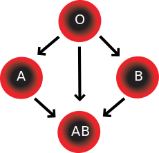
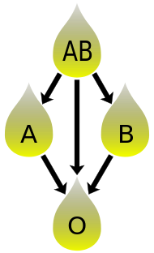

# Blood Relations — relations, orders, and a thin category

_Last updated: 2025-08-18 (GitHub math with $…$ / $$…$$)_

This page uses ABO (+/− Rh) blood types to build intuition for mappings, relations, partial orders, and how every poset forms a thin category. It is intentionally concrete first, then formal.

---

## 1) Setup and definitions

Let  
\(T = \{ \mathrm{O^-}, \mathrm{O^+}, \mathrm{A^-}, \mathrm{A^+}, \mathrm{B^-}, \mathrm{B^+}, \mathrm{AB^-}, \mathrm{AB^+} \}\).

We will look at two relations on \(T\):

- **RBC compatibility.** Define a relation \(\preceq\) on \(T\) by:  
  \(a \preceq b\) iff “recipient \(a\) can receive red blood cells (RBC) from donor \(b\).”

- **Plasma compatibility.** Define a relation \(\preceq_{\mathrm{pl}}\) on \(T\) by:  
  \(a \preceq_{\mathrm{pl}} b\) iff “recipient \(a\) can receive plasma from donor \(b\).”

To reason mechanically, model each blood type \(t\) by the set of antigens present on its RBC surface:  
\(\mathrm{Ag}(t) \subseteq \{ A, B, Rh \}\) with
```
O-  → {}
O+  → {Rh}
A-  → {A}
A+  → {A, Rh}
B-  → {B}
B+  → {B, Rh}
AB- → {A, B}
AB+ → {A, B, Rh}
```

Then the two relations are captured by subset tests:

- **RBC:** \(a \preceq b \iff \mathrm{Ag}(b) \subseteq \mathrm{Ag}(a)\).  *(Donor antigens must be a subset of recipient antigens.)*
- **Plasma:** \(a \preceq_{\mathrm{pl}} b \iff \mathrm{Ag}(a) \subseteq \mathrm{Ag}(b)\).  *(Antibodies story; equivalently, the opposite order.)*

> **Orientation note (RBC):** with the definition above, **AB+ is the bottom** (can receive from all donors) and **O− is the top** (can donate to all recipients). Plasma is the **order dual** of RBC.

Clinical caveat: we are idealizing to standard ABO + Rh and ignoring rarer antigen systems and edge cases.

---

## 2) RBC compatibility table (recipient rows, donor columns)

Legend: Y = compatible, . = not compatible. Rows are recipients; columns are donors (same order).

| Recv \\ Don | O- | O+ | A- | A+ | B- | B+ | AB- | AB+ |
|---|---:|---:|---:|---:|---:|---:|---:|---:|
| **O-**  | Y | . | . | . | . | . | . | . |
| **O+**  | Y | Y | . | . | . | . | . | . |
| **A-**  | Y | . | Y | . | . | . | . | . |
| **A+**  | Y | Y | Y | Y | . | . | . | . |
| **B-**  | Y | . | . | . | Y | . | . | . |
| **B+**  | Y | Y | . | . | Y | Y | . | . |
| **AB-** | Y | . | Y | . | Y | . | Y | . |
| **AB+** | Y | Y | Y | Y | Y | Y | Y | Y |



[Blood Compatibility](https://en.wikipedia.org/wiki/Blood_type#/media/File:Blood_Compatibility.svg)


Immediate consequences (prove using \(\mathrm{Ag}\)-sets):

- **Reflexive:** \(\mathrm{Ag}(t) \subseteq \mathrm{Ag}(t)\) for all \(t\).
- **Transitive:** if \(\mathrm{Ag}(b) \subseteq \mathrm{Ag}(a)\) and \(\mathrm{Ag}(c) \subseteq \mathrm{Ag}(b)\) then \(\mathrm{Ag}(c) \subseteq \mathrm{Ag}(a)\).
- **Antisymmetric:** if \(\mathrm{Ag}(b) \subseteq \mathrm{Ag}(a)\) and \(\mathrm{Ag}(a) \subseteq \mathrm{Ag}(b)\) then \(\mathrm{Ag}(a) = \mathrm{Ag}(b)\), hence \(a = b\).

Therefore \((T, \preceq)\) is a **poset** with **top = \(\mathrm{O^-}\)** and **bottom = \(\mathrm{AB^+}\)**.

---

## 3) Plasma compatibility table (recipient rows, donor columns)

Using the dual test \(\mathrm{Ag}(a) \subseteq \mathrm{Ag}(b)\). Legend as above.

| Recv \\ Don | O- | O+ | A- | A+ | B- | B+ | AB- | AB+ |
|---|---:|---:|---:|---:|---:|---:|---:|---:|
| **O-**  | Y | Y | Y | Y | Y | Y | Y | Y |
| **O+**  | . | Y | . | Y | . | Y | . | Y |
| **A-**  | . | . | Y | Y | . | . | Y | Y |
| **A+**  | . | . | . | Y | . | . | . | Y |
| **B-**  | . | . | . | . | Y | Y | Y | Y |
| **B+**  | . | . | . | . | . | Y | . | Y |
| **AB-** | . | . | . | . | . | . | Y | Y |
| **AB+** | . | . | . | . | . | . | . | Y |



[Plasma donation compatibility](https://en.wikipedia.org/wiki/File:Plasma_donation_compatibility_path.svg)

Hence \((T, \preceq_{\mathrm{pl}})\) is the **opposite order** of \((T, \preceq)\):
- **Plasma:** **top = \(\mathrm{AB^+}\)** (universal plasma donor), **bottom = \(\mathrm{O^-}\)** (universal plasma recipient).

---

## 4) People → BloodTypes as a function in Set

Let \(p : \mathrm{People} \to T\) map a person to their blood type.

In the category **Set** (functions between sets):
- **Mono = injective**, **Epi = surjective**, **Iso = bijection** (mono + epi with inverse).

Typical properties of \(p\) in practice:
- Not mono (many people share the same blood type).
- May or may not be epi (depends on your population sample covering all 8 types).
- Not an endomorphism (domain ≠ codomain).

\(p\) induces an **equivalence relation** on People:
\(x \sim y \iff p(x) = p(y)\).
The equivalence classes are the **fibers** \(p^{-1}(t)\) for \(t \in T\) (the blood-type cohorts).

---

## 5) From posets to a thin category

Any poset \((T, \preceq)\) defines a **thin category** \(\mathcal{C}\):
- **Objects:** \(T\)
- **Morphisms:** a unique arrow \(b \to a\) iff \(a \preceq b\)
- **Identities** are given by reflexivity; **composition** by transitivity.

You can speak of “the blood-compatibility category” whose arrows point from donors to recipients according to \(\preceq\).

---

## 6) Exercises (pick a couple)

1) Using the \(\mathrm{Ag}\)-sets above, prove reflexivity, transitivity, and antisymmetry of \(\preceq\). Identify top and bottom.
2) Draw the **Hasse diagram** for \((T, \preceq)\). Then draw the Hasse diagram for plasma and observe it is the order dual.
3) For a small toy set of People, write out the fibers \(p^{-1}(t)\) and the induced partition of People.
4) Form the thin category from \((T, \preceq)\). Identify identities and composition explicitly in this setting.
5) *(Stretch)* Replace Rh with a second factor “K” and predict how the tables and order change.

---

## 7) References and further study

- Fong & Spivak, “Seven Sketches in Compositionality,” Chapter 1 (preorders, partitions; introduction to Galois connections).
- Lawvere & Schanuel, “Conceptual Mathematics,” early chapters on equivalence relations and orders.
- (Optional) J. Baez, ACT lectures on preorders and posets (for more exercises).

> Tip: This page is an idealized model. Clinical transfusion guidance incorporates additional antigens and safety checks beyond ABO+Rh.
