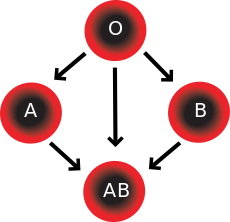
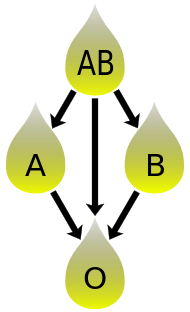

# Blood Relations — relations, orders, and a thin category

_Last updated: 2025-08-18 (GitHub-friendly, no LaTeX)_

This page uses ABO (+/− Rh) blood types to build intuition for mappings, relations, partial orders, and how every poset forms a thin category. It is intentionally concrete first, then formal.

---

## 1) Setup and definitions

Let
T = { O-, O+, A-, A+, B-, B+, AB-, AB+ }.

We will look at two relations on T:

- **RBC compatibility.** Define a relation ≼ on T by:
  a ≼ b  iff “recipient a can receive red blood cells (RBC) from donor b.”

- **Plasma compatibility.** Define a relation ≼_pl on T by:
  a ≼_pl b  iff “recipient a can receive plasma from donor b.”

To reason mechanically, model each blood type t by the set of antigens present on its RBC surface:
Ag(t) ⊆ { A, B, Rh } with
```
O-  → {}
O+  → {Rh}
A-  → {A}
A+  → {A, Rh}
B-  → {B}
B+  → {B, Rh}
AB- → {A, B}
AB+ → {A, B, Rh}
```

Then the two relations are captured by subset tests:

- **RBC:** a ≼ b  iff  Ag(b) ⊆ Ag(a).  (Donor antigens must be a subset of recipient antigens.)
- **Plasma:** a ≼_pl b  iff  Ag(a) ⊆ Ag(b).  (Antibodies story; equivalently, the opposite order.)

> Orientation note for RBC: with the definition above, **AB+ is the bottom** (can receive from all donors) and **O− is the top** (can donate to all recipients). Plasma is the order dual of RBC.

Clinical caveat: we are idealizing to standard ABO + Rh and ignoring rarer antigen systems and edge cases.

---

## 2) RBC compatibility table (recipient rows, donor columns)

Legend: Y = compatible, . = not compatible. Rows are recipients; columns are donors (same order).

| Recv \ Don | O- | O+ | A- | A+ | B- | B+ | AB- | AB+ |
|---|---:|---:|---:|---:|---:|---:|---:|---:|
| **O-**  | Y | . | . | . | . | . | . | . |
| **O+**  | Y | Y | . | . | . | . | . | . |
| **A-**  | Y | . | Y | . | . | . | . | . |
| **A+**  | Y | Y | Y | Y | . | . | . | . |
| **B-**  | Y | . | . | . | Y | . | . | . |
| **B+**  | Y | Y | . | . | Y | Y | . | . |
| **AB-** | Y | . | Y | . | Y | . | Y | . |
| **AB+** | Y | Y | Y | Y | Y | Y | Y | Y |



[Blood Compatibility](https://en.wikipedia.org/wiki/Blood_type#/media/File:Blood_Compatibility.svg)

Immediate consequences (prove using Ag-sets):
- **Reflexive:** Ag(t) ⊆ Ag(t) for all t.
- **Transitive:** if Ag(b) ⊆ Ag(a) and Ag(c) ⊆ Ag(b) then Ag(c) ⊆ Ag(a).
- **Antisymmetric:** if Ag(b) ⊆ Ag(a) and Ag(a) ⊆ Ag(b) then Ag(a) = Ag(b), hence a = b.

Therefore (T, ≼) is a **poset** with **top = O−** and **bottom = AB+**.

---

## 3) Plasma compatibility table (recipient rows, donor columns)

Using the dual test Ag(a) ⊆ Ag(b). Legend as above.

| Recv \ Don | O- | O+ | A- | A+ | B- | B+ | AB- | AB+ |
|---|---:|---:|---:|---:|---:|---:|---:|---:|
| **O-**  | Y | Y | Y | Y | Y | Y | Y | Y |
| **O+**  | . | Y | . | Y | . | Y | . | Y |
| **A-**  | . | . | Y | Y | . | . | Y | Y |
| **A+**  | . | . | . | Y | . | . | . | Y |
| **B-**  | . | . | . | . | Y | Y | Y | Y |
| **B+**  | . | . | . | . | . | Y | . | Y |
| **AB-** | . | . | . | . | . | . | Y | Y |
| **AB+** | . | . | . | . | . | . | . | Y |



[Plasma donation compatibility](https://en.wikipedia.org/wiki/File:Plasma_donation_compatibility_path.svg)


Hence (T, ≼_pl) is the **opposite order** of (T, ≼):
- **Plasma:** **top = AB+** (universal plasma donor), **bottom = O−** (universal plasma recipient).

---

## 4) People → BloodTypes as a function in Set

Let p : People → T map a person to their blood type.

In the category **Set** (functions between sets):
- **Mono = injective**, **Epi = surjective**, **Iso = bijection** (mono + epi with inverse).

Typical properties of p in practice:
- Not mono (many people share the same blood type).
- May or may not be epi (depends on your population sample covering all 8 types).
- Not an endomorphism (domain ≠ codomain).

p induces an **equivalence relation** on People:
x ~ y iff p(x) = p(y).  
The equivalence classes are the **fibers** p⁻¹(t) for t in T (the blood-type cohorts).

---

## 5) From posets to a thin category

Any poset (T, ≼) defines a **thin category** C:
- Objects: T
- Morphisms: a unique arrow b → a iff a ≼ b
- Identities are given by reflexivity; composition by transitivity.

You can speak of “the blood-compatibility category” whose arrows point from donors to recipients according to ≼.

---

## 6) Exercises (pick a couple)

1) Using the Ag-sets above, prove reflexivity, transitivity, and antisymmetry of ≼. Identify top and bottom.
2) Draw the **Hasse diagram** for (T, ≼). Then draw the Hasse diagram for plasma and observe it is the order dual.
3) For a small toy set of People, write out the fibers p⁻¹(t) and the induced partition of People.
4) Form the thin category from (T, ≼). Identify identities and composition explicitly in this setting.
5) (Stretch) Replace Rh with a second factor “K” and predict how the tables and order change.

---

## 7) References and further study

- [Wikipedia article on blood types](https://en.wikipedia.org/wiki/Blood_type)
- Fong & Spivak, “Seven Sketches in Compositionality,” Chapter 1 (preorders, partitions; introduction to Galois connections).
- Lawvere & Schanuel, “Conceptual Mathematics,” early chapters on equivalence relations and orders.
- (Optional) J. Baez, ACT lectures on preorders and posets (for more exercises).

> Tip: This page is an idealized model. Clinical transfusion guidance incorporates additional antigens and safety checks beyond ABO+Rh.
